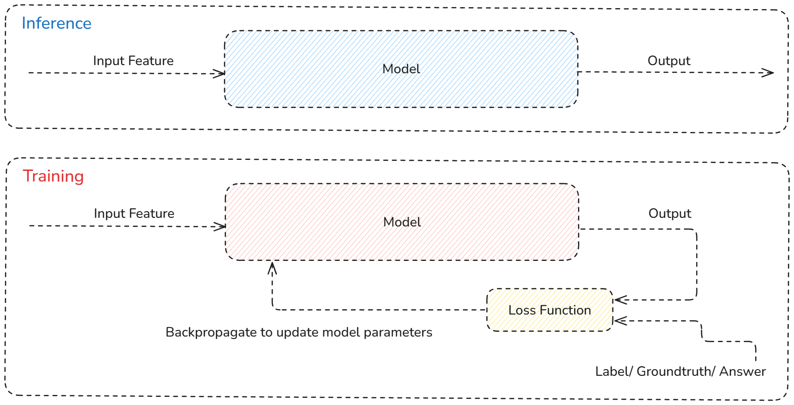

# 在ChatGPT 還沒瘋狂之前：AI 是怎麼做出決策的？

## 前言
身處在 ChatGPT 帶來的 AI 世代裡，這股商業脅持技術的浪潮，正以前所未有的速度席捲各行各業。從產品設計、商業決策，到日常生活的微小選擇，「AI 加持」彷彿能解決人類所有遇到瓶頸的問題。然而，喧囂的市場往往忽略了本質。

回顧歷史，人工智慧的發展絕非一蹴可幾。自 1956 年達特茅斯會議首次提出「AI」概念以來，這項技術歷經數次高潮與寒冬——從符號主義、機器學習（Machine Learning），到深度學習（Deep Learning）、ChatGPT這些AI代名詞的興起，每一次的迭代都重新定義了人們對「智慧」的想像。即便技術名稱與方法不斷演變，AI的底層本質始終如一：資料與模型，是它的雙驅動引擎。

本篇會循著三個問題往下走：先拆解分類器的核心概念與日常案例，再釐清分類與回歸的差異，最後從訓練與推論的角度初談現代模型的生命流程，讓一些名詞提前出現，雖打破歷史發展的順序，但希望透過這樣的節奏，讓讀者對於AI有一個最基礎的認識。

## 打開分類器的黑盒，分類器是什麼？

分類器就一種「對應關係」，把「輸入資料」對應到「離散類別」的函數。它觀察輸入特徵（Features），使用既定的決策邏輯判斷「這筆資料屬於哪個類別」。

最有名的應用:
> - iPhone 的 Face ID 會把臉部影像二分法，分類成「主人」或「陌生人」，決定裝置是否解鎖。  
> - Tesla FSD（Full Self-Driving）透過鏡頭影像進行多類別，辨識「行人」、「汽車」、「號誌燈」，好讓車輛能感知真實世界的環境。

## 分類還是回歸？

在實務中，多數任務的核心都是讓模型學會判斷答案。學術上，這類任務屬於監督式學習（Supervised Learning），也就是透過已知的「問題與答案」資料來訓練模型，預測未來結果。

要讓機器理解問題，第一步是確認答案的型態：
若答案是離散類別，屬於分類（Classification）問題。
若答案是連續數值，則是回歸（Regression）問題。

| 問題型態 | 典型任務 | 結果型態 | 例子 |
| --- | --- | --- | --- |
| 分類（Classification）| 判別資料落在哪個類別 | 離散 | 紅綠燈號誌（紅／黃／綠）、腫瘤是否為惡性 |
| 回歸（Regression）| 預測連續數值 | 實數或區間值 | 未來房價、氣溫曲線、股票收盤價 |

想把回歸問題改寫成分類題也很常見，例如把房價區間切成「高／中／低」三類，再交由分類器處理。

## 模型Model中，甚麼是Training、甚麼是Inference？

架構示意圖如下所示。


> - Training（訓練）：模型讀取大量「特徵＋標籤」的組合，調整參數讓預測更接近真實答案。  
> - Inference（推論）：模型接收尚未看過的資料，只靠訓練好的參數產生預測結果。

了解這兩個階段，有助於區分「模型在學習」和「模型在回答」。

## 常見術語

### Feature（特徵）

1. **特徵是可量化的資料描述**，是模型用來理解世界的依據。
2. **特徵可以是連續訊號在數位空間的投影**：

   * 例如，一張彩色影像可攤平成一個 (1024 × 1024 × 3) 的張量，每個元素代表紅、綠、藍三個通道的像素亮度。這 **3,145,728 個像素值** 就是影像的特徵。
3. **特徵也可以是壓縮後的高維向量**：

   * 例如，聲音訊號可以透過梅爾頻譜（Mel-spectrogram）轉換為一個 **128 維的向量**，用以表示聲音的頻率特性。
4. **特徵也可以是離散符號在向量空間的投影**：

   * 例如，文字可透過詞向量（word embedding）表示為一個 **300 維向量**，讓模型能理解語意關係。
5. **簡單來說，特徵就是模型的輸入資料**，是所有預測、分類與決策的起點。

### Label（標籤）
標籤就是人類賦予的答案。  
  
例：以Google驗證當作範例，請人類幫忙標註哪裡有斑馬線，就是在幫Google建立資料的標籤，讓他們的模型可以知道答案。

### Logit
模型輸出的線性組合結果。
輸入 softmax 函數後，可以表達機率分佈。  
例：唯一這筆資料的 logits 為 [1.01, 0.56]，差距 0.45，顯示模型更偏向類別 0。

### Loss Function（損失函數）
衡量模型預測與真實標籤差異的函數，也決定訓練時要「往哪裡修正」參數。  
例：交叉熵損失約 0.49，若未來調整後降到 0.1，就代表預測和真實答案更接近。

### Backpropagation（反向傳播）
從損失函數出發沿著模型反向傳遞誤差，計算每個參數的梯度，搭配優化器（如梯度下降）更新權重，模型才能越學越準。  
例：梯度運算得到 `grad_b ≈ [-0.39, 0.39]`，代表第一個偏差需要往上調，第二個偏差則往下調。

下面用 NumPy 寫一個最小可運行的「線性分類器（邏輯迴歸）」範例，串起 Forward → Loss → Backprop → Update 的整個流程。程式會生成一個簡單的二分類資料集，訓練後回報訓練集準確率。

```python
import numpy as np

# --- Inputs ---------------------------------------------------------------
# 1) 一筆資料，包含三個特徵（feature 向量）
X = np.array([[0.2, 1.1, -0.3]])

# 2) 正確標籤：0 表示「不是主人」、1 表示「主人」
y = np.array([0])

# 3) 線性分類器的初始權重與偏差（可學參數）
W = np.array([[1.2, -0.7],
              [0.5,  0.9],
              [-0.4, 0.3]])
b = np.array([0.1, -0.2])

# --- Forward pass ---------------------------------------------------------
# Step A: 計算 logits（線性組合 XW + b）
logits = X @ W + b                # ≈ [[1.01, 0.56]]

# Step B: 使用 softmax 把 logits 轉為各類別機率
exp_logits = np.exp(logits - logits.max(axis=1, keepdims=True))  # 數值穩定技巧
probs = exp_logits / exp_logits.sum(axis=1, keepdims=True)       # ≈ [[0.61, 0.39]]

# Step C: Cross Entropy Loss- 衡量預測與真實標籤的差距指標
true_probs = probs[np.arange(len(y)), y]
loss = -np.log(true_probs).mean()  # ≈ 0.49

print("Logits:\n", logits)
print("Probabilities:\n", probs)
print("Loss:", loss)

# --- Backward pass --------------------------------------------------------
# Step D: ∂Loss/∂logits（softmax + cross-entropy 的Closed-form）
grad_logits = probs.copy()            # ≈ [[0.61, 0.39]]
grad_logits[np.arange(len(y)), y] -= 1  # ≈ [[-0.39, 0.39]]
grad_logits /= len(y)                 # ≈ [[-0.39, 0.39]]（batch=1）

# Step E: 透過Chain Rule，反向把梯度傳回權重與偏差 (Backpropagation)
grad_W = X.T @ grad_logits            # ≈ [[-0.0779, 0.0779], [-0.4283, 0.4283], [0.1168, -0.1168]]
grad_b = grad_logits.sum(axis=0)      # ≈ [-0.39, 0.39]

print("Grad W:\n", grad_W)
print("Grad b:", grad_b)

# --- Parameter update -----------------------------------------------------
# Step F: 以梯度下降(Gradient Descent) 更新參數（W ← W - η · 梯度）
learning_rate = 0.1
W -= learning_rate * grad_W          # ≈ [[1.208, -0.708], ...]
b -= learning_rate * grad_b          # ≈ [0.139, -0.239]

print("Updated W:\n", W)
print("Updated b:", b)
```

經過一次 Forward Pass: Inference（前向傳遞）、Loss（損失計算） 與 Backward Pass: Backpropagation（反向傳遞）的流程後，模型參數中的權重（weights）與偏差（bias）就會被更新。接著，這些新的參數會在下一輪訓練中再次參與運算，讓分類器的表現逐步提升。透過不斷迭代這個過程，最終我們便能得到一個訓練完成的模型。此時，在實際應用階段，就只需要進行Inference，模型便能根據輸入資料進行推論並輸出預測結果。


## 小結
本篇文章初步介紹了分類與回歸問題的基本分野，並且先行跳過歷史脈絡，直接一窺訓練（Training）與推論（Inference）在整個模型生命週期中的核心角色。透過這些基礎概念的鋪陳，我們已經建立起理解機器學習任務的第一層視角。

## 下一篇預告：《從薛西弗斯到普羅米修斯：AI 決策的進化與解放》
在進入大算力與深度學習驅動的時代之前，AI 的發展像是薛西弗斯的宿命——科學家跟工程師們不斷用規則與傳統機器學習推動智慧之石，卻始終被資料稀缺、算力有限和模型表現的天花板所束縛。

接下來的文章，我們將回到這段艱難卻關鍵的歷史現場，看看從 Rule-based 系統、決策樹（Decision Tree）到支持向量機（SVM） 等方法，如何一步步奠定了 AI 的基礎，並理解為何它們終究無法突破所謂的「工人智慧」極限。

而當GPU 伺服器叢集、大模型（Large Models）與大數據（Big Data）登場後，一切都改變了：AI 不再只是推石上山，而是如同普羅米修斯偷火一般，點燃了智慧的火種。這正是我們今日所見到大語言模型時代的起點。

---
